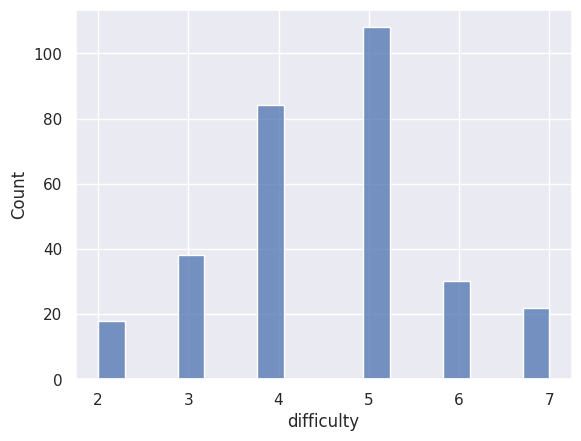
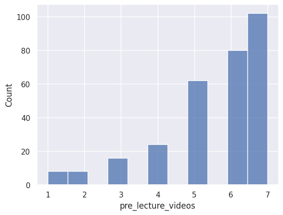
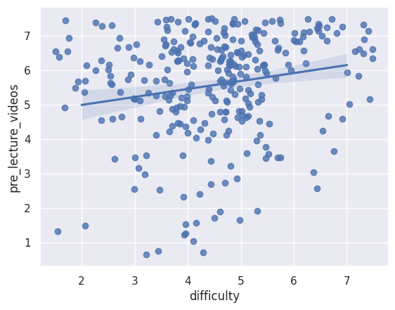
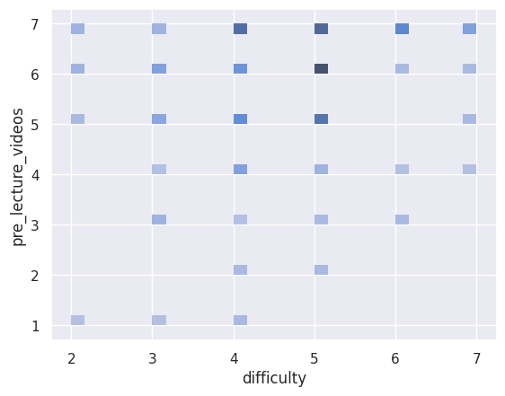

---
# Do not edit the text between these lines!
layout: default
---

# EX 09 - Johnny Ta and Bianca Salve

## Analysis Summary

For our analysis, we wanted to look at the relationship between student's percieved difficulty of COMP110 and student's desire for pre-lecture videos. We hypothesized that the higher that students rank the difficulty of COMP 110, the more likely they would want pre-class videos. We reasoned this to be more valuable than the other ideas because with the results, professors will be able to determine whether or not the creation of pre-class videos would benefit studnets in future sections. 

To analyze the data we took the data through a few steps:

1. After importing the two surveys, we converted them to column-based tables, and combined the results to make analysis much simpler.
2. Following that, we utilized the `head` function to check the first 5 lines of the table to ensure to check the dictionary.
3. Subsequently, we created a function named `no_exp` to iterate through the results and create a new list only with students who had little to no coding experience.
4. Following that, we again called the head function to check that the first few lines of the dictionary were correct.
5. We then called the count function to count the frequency of each rating of `pre_lecture_videos` among those students with little to no coding experience.
6. Next, we used `select` to only choose our two variables of interest, `pre_lecture_videos` and `difficutly`. 
7. Finally, we used seaborn to create four graphs: 2 histograms, 1 linear regression/scatterplot, and 1 bivariate histogram.

 

### 7.1 Seaborn Visualizations - Histogram (Difficulty)

This was our first histogram, where we visualized the frequency of each rating of `difficutly` in COMP110 students who had little to no previous coding experience. We found that most students rated it a moderate level of difficulty, around a 5 on a scale of 1-7.

### 7.2 Seaborn Visualizations - Histogram (Pre-class Lectures)

This was our second histogram, where we visualized the frequency of each rating for `pre_class_videos` in COMP110 students with little to no previous coding experience. We found that most students wanted pre-class videos, with the majority of respondents responding with 5-7 on a scale of 1-7.

### 7.3 Seaborn Visualizations - Scatterplot

This was our scatterplot, where we plotted the responses of `difficulty` (x-axis), and `pre_lecture_videos` (y-axis) on a scatterplot. We added jitter to the graph to spread out the plotted points for the sake of visualization, as there were only whole number values responses. We found that, generally, as people's rating of COMP110 increased, their desire for pre-lecture videos also increased. 

### 7.4 Seaborn Visualizations - Bivariate Histogram

Finally, this was our bivariate histogram, where we plotted the responses of `difficulty` (x-axis), and `pre_lecture_videos` (y-axis). Again, we found that, generally, as people's rating of COMP110 increased, their desire for pre-lecture videos also increased. Additionally, with the bivariate histogram we can see that a larger number of students rated COMP110 a 4-6 in difficulty, and rated their desire for pre-lecture-videos 5-7, on a scale of 1-7.

## Conclusion

As mentioned earlier, most students found COMP110 to be moderately difficult, with about 140 students indicating a difficulty level of 4, and about 130 students indicating a difficulty level of 5 on a 7 point scale. The graph was slightly skewed to the left (indicating a higher concentration of students indicating a higher difficulty level). There were no significant outliers, but a few students rated COMP110 with a difficulty of 1 (about 7 to 10 students). In terms of pre-lecture videos, 100 students provided a score of 5, 110 provided a score of 6, and about 145 rated a score of 7, indicating a high demand for pre-lecture videos and a positive correlation between number of students and demand of pre-lecture videos. While the scatterplot indicated a wide array of results, it is important to note that the slope is positive, meaning that as the number of students increased, the more the value of pre-lecture videos increased. The addition of pre-lecture videos would not have too many monetary costs, as the university pays for video recording and hosting services like Panapto, but it may cost professors/TA's a little bit of their time. Furthermore, we don't see any negative impacts on any stakeholders, as it would help students, possibly improve the overall grades of the course, and may even give the CS department and the university a higher reputation.